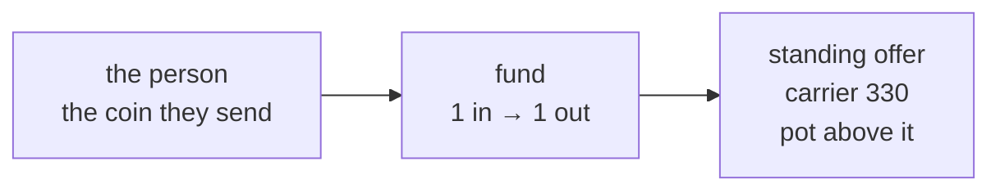
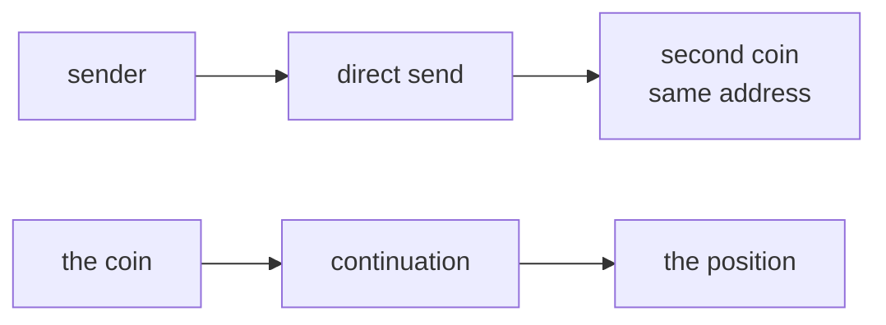
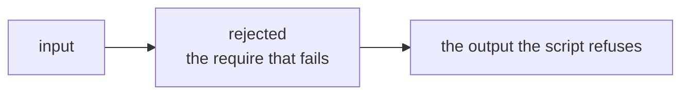
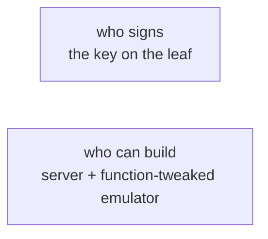

# Draw the covenant

Run this after `writing-arkade-contracts` and before `arkade-contract`. The `.ark` file is already written. Read that file and draw it. Regenerate the story when the file changes, in the same commit.

## The story

The deliverable is a short story in the app README: four mermaid pictures, in this order. Pictures 1 and 3 are one transaction each, inputs then a spine then outputs. Picture 2 places the direct send beside the continuation. Picture 4 sets who signs opposite who can build the leaf. The caption is one sentence.

1. The coin the person sends.
2. The direct send: a second coin beside the continuation.
3. The rejected transaction.
4. Who signs, versus who can build the server plus the function-tweaked emulator. A `require` is not authorization.

Picture 1 uses this shape. The node text comes from the `.ark` file. Leave these placeholders out of the README. The spine names the function and the value outputs, with the comparison the script writes.

An interactive page is only when a public input changes the payment, as in options. A price-function section is drawn only when the script reads a public number. Escrow pays the committed `amount`, so it has neither.

## Amounts

Amounts that are not in the `.ark` file do not appear. 330 sats is the carrier. The pot is the sats above it. A constructor parameter is drawn under its name (`amount`, `collateral`, `premium`). A sample from a test, a fixture, or `/v1/info` is not a number in the story.

Show the comparison the script writes. A `>=` check is not `sats in = out`. An output the script does not pin is labeled unconstrained. An asset moves in the same units. Draw an extension output only when the contract reads `tx.packet`, and the anchor only when a control asset continues. Neither gets a sat amount.

## The four pictures

### 1. The coin the person sends

The person funds the address. Name the sender. The output is that one coin. Label the carrier as 330 sats and the pot as the sats above it. Add the asset when the `.ark` file names its amount. This is the position the contract continues.

### 2. The direct send

Draw two transactions side by side. One is a direct send to the same address. The other is the spend that pays the continuation script, or the issuance that leaves the anchor on the coin. A direct send creates a second coin beside the one the contract continues. Only a spend that pays the continuation script changes the position the contract tracks.

### 3. The rejected transaction

Draw one transaction the script refuses, in the same shape as picture 1. Name the `require` that fails: the deadline already passed, a second copy of the same script, an output the function does not name. Mark the picture rejected. A rejected picture may fail to balance. Say so in the caption. Leave the failing outputs as they are.

### 4. Who signs

Two sides.

- Who signs: the key on the tapscript, the oracle signature the script checks, or the receiver spending the script they named when they took the coins, as `OptionIntent` does.
- Who can build: a covenant function with no matching tapscript is the server plus the function-tweaked emulator. Anyone who can build that transaction can pass the `require`.

The caption is: a `require` is not authorization. It checks the transaction. It does not identify who may move the coins.

Close with two lines. Enforced: the checks these pictures turned on. Not claimed: oracle honesty, liveness, and a destination the script does not pin.

## Examples

Learn the shape from escrow and one standing offer, then draw the contract in this commit.

Escrow is `compiler/examples/escrow/escrow.ark`. Party A sends the coin. `complete` pays `partyBScript` at least `amount`, and a surplus above 330 to `partyAScript`. `cancel` returns the coin after `checkTime(timeoutAt)`. The oracle signs the committed message. `complete` and `cancel` are server plus emulator. `unilateral` is party A and party B after `older(serverExitDelay)`.

One standing offer is `compiler/examples/option/option_intent.ark`, or the pot. OptionIntent names `collateral`, `premium`, and `DUST` (330). The funder does not sign `finalize`. That spend takes this coin plus one input whose script is not this intent, and pays the scripts the constructor already named. The pot is the standing offer with no other amounts in the file: carrier 330, pot above it. Draw the one this contract is.

## Options

Fares, dust kinks, and oracle prices stay in the options example, [arkade-options](https://github.com/ArkLabsHQ/arkade-options) (`contracts/option_vault.ark`, `viz/index.html`). Leave them out of escrow and the pot.

That vault reads a public price and pays from it, so the price-function section belongs there. State the formula the file writes. The dust kink is the price where a leg falls to 330 and the output count changes. The protocol fare is the operator's charge. It is not the premium. In that file, `pot` means locked value minus `readFee`. Here the pot is the sats above the 330-sat carrier.

The interactive page is that options case. The control sets the public number the script reads and calls the same function the tests use. Show that number next to the settlement it produced. The control cannot show a payment the formula does not produce. Draw another settlement only when the fold changes how many outputs there are.

## Check

The README, the `.ark` file, and the artifact are in one commit. The four pictures are in order. Every satoshi amount is 330 or a literal in the `.ark` file. The direct send is not the continuation. The rejected picture stays rejected. Picture 4 states that a `require` is not authorization. There is no price-function section unless the script reads a public number, and no interactive page unless that number changes the payment.

Then spend the artifact with `arkade-contract`. The screen follows this picture and shows one next action. It does not invent a second protocol.
